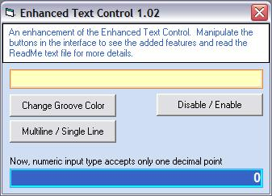



## Enhanced Text Control 1\.02

### Description

This is an enhancment of the usercontrol submitted by Priyank Modi at

http://www.pscode.com/vb/scripts/ShowCode.asp?txtCodeId=64582&amp;lngWId=1

With permission from the original author, I modified it and reposted for your use. Hope you like the enhancements.

A vote will be appreciated while comments will be most welcome.

Thanks and God Bless!

Enhancements in this version:

* Fixed the conflict of the previous version with the Left$ and Right$ functions

* Numeric input type now accepts only one decimal point

* Added the multiliner property

* Added the control over the groove color

* Added disabled state and colors for

-&gt; Backcolor

-&gt; Border Color

-&gt; Border Pattern

-&gt; Groove

I suggest compiling it into an ocx for better performance.

God Bless!!
 
### More Info
 

             |
---                |---
**Submitted On**   |2006-11-01 20:00:02
**By**             |[Francis Arnold G\. Balatico](https://github.com/Planet-Source-Code/PSCIndex/blob/master/ByAuthor/francis-arnold-g-balatico.md)
**Level**          |Intermediate
**User Rating**    |5.0 (15 globes from 3 users)
**Compatibility**  |VB 6\.0
**Category**       |[Custom Controls/ Forms/  Menus](https://github.com/Planet-Source-Code/PSCIndex/blob/master/ByCategory/custom-controls-forms-menus__1-4.md)
**World**          |[Visual Basic](https://github.com/Planet-Source-Code/PSCIndex/blob/master/ByWorld/visual-basic.md)
**Archive File**   |[Enhanced\_T2028281112006\.zip](https://github.com/Planet-Source-Code/francis-arnold-g-balatico-enhanced-text-control-1-02__1-66958/archive/master.zip)

